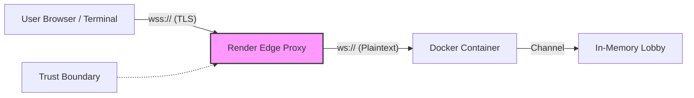
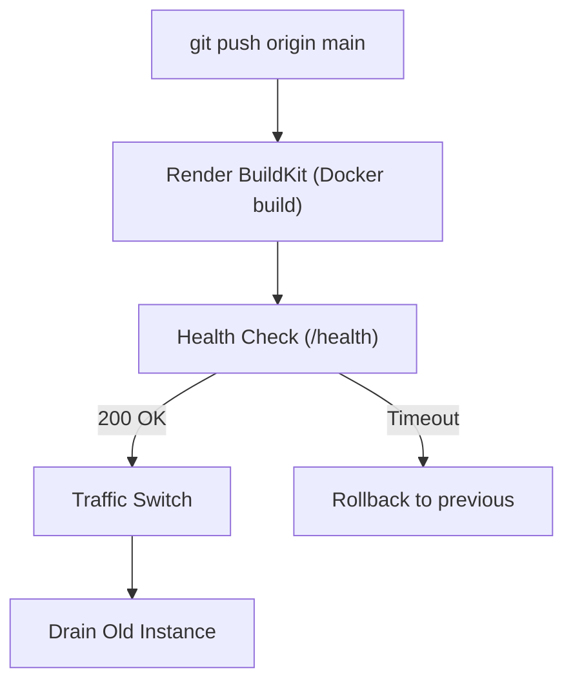
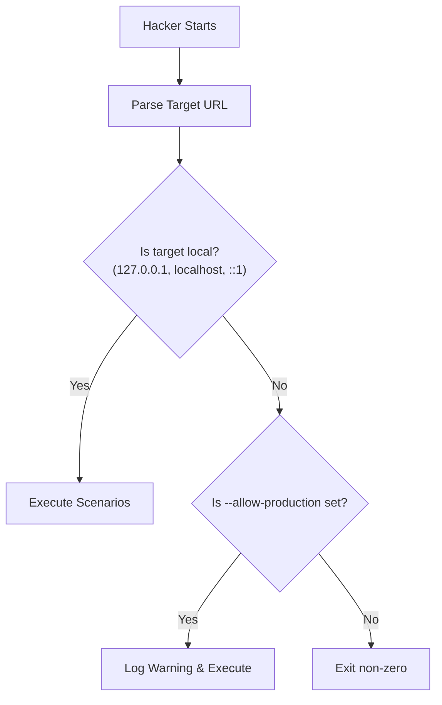

# Deployment Guide

This guide is for operators who want to host their own instance of `tictactoe-rs`. It walks through deploying the server securely, configuring its production defenses, and protecting it from malicious actors (including the bundled adversarial `hacker` crate).

## Introduction

This guide focuses on **Render** as a worked example because of its built-in Docker support, free tier, and simple `render.yaml` orchestration. However, the architectural principles apply anywhere: the image runs a plain HTTP/WS socket, expects TLS to be terminated at the platform edge, and configures itself entirely via environment variables.

We will cover:
1. Deploying to Render via Blueprint or manual configuration.
2. Adapting the deployment for other platforms (Fly.io, Railway, self-hosted Docker).
3. The mandatory production hardening checklist.
4. The security implications of the adversarial `hacker` crate.

## Prerequisites

- A GitHub account (to fork or host the repository).
- A container platform account (e.g., Render, Fly.io, Railway).
- The `tictactoe-rs` repository cloned locally.
- Docker installed locally (to verify the build).
- Basic familiarity with environment variables and network ports.
- App-level prerequisites (such as supported Rust and Docker Compose versions) are listed in the main [`README.md`](../README.md).

## Deploying to Render (worked example)

### 3.1 The `render.yaml` blueprint

The repository includes a `render.yaml` file at its root. This blueprint instructs Render how to build and expose the service:

```yaml
services:
  - type: web
    name: tictactoe-rs
    runtime: docker
    dockerfilePath: ./Dockerfile
    healthCheckPath: /health
    autoDeploy: false
    plan: free
    region: frankfurt
```

- `type: web`: Defines this as a web service that accepts incoming HTTP/WS traffic.
- `runtime: docker`: Instructs Render to build the image from source.
- `dockerfilePath`: The path to the multi-stage Dockerfile.
- `healthCheckPath`: The endpoint Render will poll to confirm the container is alive before routing traffic (verified in `crates/server/src/main.rs`).
- `autoDeploy: false`: Prevents automatic deployment on every push (you can enable this in the dashboard).
- `plan: free`: Deploys to the free tier by default.
- `region`: The geographic region to deploy in.

### 3.2 One-click deploy via Blueprint

1. Fork or push the `tictactoe-rs` repository to your GitHub account.
2. In the Render dashboard, click **New > Blueprint**.
3. Connect your GitHub repository.
4. Render will read `render.yaml` automatically and prompt you to confirm the deployment.
5. Note: The YAML does not declare all the `0.2.0` environment variables yet. You will need to add them manually in the Render dashboard after the service is created.

### 3.3 Manual Web Service alternative

If you prefer to configure everything manually without the blueprint:
1. In the Render dashboard, click **New > Web Service**.
2. Connect your repository.
3. Configure the following fields:
   - **Language**: Docker
   - **Dockerfile Path**: `./Dockerfile`
   - **Docker Context**: `.` (the repository root)
   - **Health Check Path**: `/health`

### 3.4 Configuring environment variables

Configure these environment variables in your Render dashboard (Settings > Environment). **Secrets should always be set here, never checked into the repository.**

| Variable | Default (Dev) | Default (Prod) | Production Recommendation |
|---|---|---|---|
| `TICTACTOE_ENV` | `development` | N/A | **`production`** (Mandatory). Enables strict connection limits. |
| `TICTACTOE_BIND` | `0.0.0.0:8080` | `0.0.0.0:8080` | Leave unset. Render uses the `PORT` variable. |
| `PORT` | `8080` | `8080` | Leave unset. Render injects this automatically. |
| `TICTACTOE_MAX_SESSIONS` | `10000` | `10000` | Set based on instance memory (e.g., `1000`). |
| `TICTACTOE_MAX_SESSIONS_PER_IP`| `10000` | `10` | Set to `10` or a sane value to prevent IP exhaustion. |
| `TICTACTOE_AUTH_RATE_LIMIT_PER_MINUTE`| `1000` | `10` | Set to `10` to thwart brute force and CPU starvation. |

### 3.5 Verifying the deployment

Once deployed, you can verify the service is running:
1. **Health Check**: Visit `https://<your-service>.onrender.com/health` in a browser. It should return an `OK` response.
2. **WebSocket Handshake**: Test the connection using `wscat` or the bundled client:
   ```bash
   ./client --server wss://<your-service>.onrender.com/ws --name test_user
   ```
3. **Log Inspection**: Check the Render dashboard logs to ensure the server started cleanly and is listening on the assigned `PORT`.

### 3.6 Free-tier caveats

If you are using the free plan:
- **Spin-down**: The instance will spin down after 15 minutes of inactivity. The first request after a spin-down will take roughly 30-50 seconds as the container restarts.
- **WebSocket Drops**: Render aggressively replaces instances during maintenance or spin-downs. This will sever all active WebSocket connections.
- **Recommendation**: For anything beyond a simple demo, upgrade to a paid instance that does not spin down.

## Adapting the guide to other platforms

### Fly.io
- Create a `fly.toml` (Fly's equivalent of `render.yaml`) using `fly launch`.
- Use `fly deploy` to build and deploy.
- Environment variables are set in the `[env]` section of `fly.toml`, and secrets via `fly secrets set`.
- **Crucial**: Fly requires an explicit `[http_service]` block in `fly.toml` to support WebSocket upgrades.

### Railway / Koyeb
- Deploy directly from GitHub using the provided `Dockerfile`.
- Environment variables are configured in the platform's dashboard UI.
- The health check path (`/health`) must be configured manually in the service settings.
- The platform will automatically handle TLS and port injection.

### Self-hosted Docker Compose
For VPS deployments, here is a complete `docker-compose.prod.yml` template:

```yaml
version: "3.9"
services:
  server:
    build: .
    ports:
      - "127.0.0.1:8080:8080" # Bind to localhost, expose via reverse proxy
    environment:
      - TICTACTOE_ENV=production
      - TICTACTOE_MAX_SESSIONS=2000
      - TICTACTOE_MAX_SESSIONS_PER_IP=10
      - TICTACTOE_AUTH_RATE_LIMIT_PER_MINUTE=10
    restart: always
```
- **Note**: You must place a reverse proxy (like Caddy, Traefik, or Nginx) in front of this container to terminate TLS and forward WebSocket traffic to `127.0.0.1:8080`.

### Raw VPS with systemd
While possible, running the raw binary as a systemd service is not recommended. Use the Docker approach above for predictable dependencies, isolated networking, and simpler updates.

## Production hardening checklist

Before exposing your server to the public internet, ensure you have completed this checklist:

- [ ] `TICTACTOE_ENV=production` is explicitly set.
- [ ] `TICTACTOE_MAX_SESSIONS` is set to a value your instance can actually handle. (Start low, monitor memory usage, and increase as needed).
- [ ] `TICTACTOE_MAX_SESSIONS_PER_IP` is configured to prevent a single malicious actor from exhausting the global cap.
- [ ] `TICTACTOE_AUTH_RATE_LIMIT_PER_MINUTE` is set. This token-bucket limit restricts authentication attempts per IP (not per username) to prevent brute-forcing and CPU starvation via Argon2id hashing.
- [ ] TLS is terminated by the platform edge. (Render/Fly handle this automatically; self-hosted operators must configure a reverse proxy).
- [ ] The health check path (`/health`) is configured and returning 200.
- [ ] Logs are being collected and monitored for `TooManySessions` and `RateLimited` events.
- [ ] The `hacker` crate is **not** installed or run against the public endpoint.

## Protecting your server from the `hacker` crate

The repository includes a `hacker` binary designed to probe the server's defenses.

### What the hacker is
The hacker runs four adversarial scenarios:
1. `session_hijack`: Attempts to send illegal state transitions (e.g., joining non-existent matches, sending malformed JSON).
2. `port_reuse`: Attempts to steal the server's port or race the TCP stack on ephemeral port reuse.
3. `flood`: Opens 32 concurrent WebSocket connections, drops them abruptly, and verifies the server reclaims resources.
4. `spectator_isolation`: Attempts to inject moves while spectating.
(See [`docs/SECURITY.md`](SECURITY.md) for full details).

### Why running it against production is dangerous
The `flood` scenario is effectively a micro-DoS attack. On a small instance (like a free tier), the rapid influx of concurrent connections and abrupt closures is indistinguishable from malicious traffic. It will consume resources, pollute logs, and may trigger the platform's automated abuse detection, leading to an IP ban or account suspension.

### The `--allow-production` guard
By default, the `hacker` refuses to execute against any target that is not a local address (`localhost`, `127.0.0.1`, `::1`). If you point it at a remote deployment, it aborts with:
```text
Error: Refusing to target remote host in non-local environment. Use --allow-production to override.
```
If you *deliberately* want to stress-test your deployment, you must explicitly opt-in:
```bash
./hacker --target wss://<your-service>.onrender.com/ws --scenario all --allow-production
```

### Server-side defenses
The `--allow-production` flag is merely a client-side courtesy guard. The **actual** security boundary is the server's configuration. If an attacker runs the hacker script against your server, `TICTACTOE_ENV=production` ensures that:
- `TICTACTOE_MAX_SESSIONS` and `TICTACTOE_MAX_SESSIONS_PER_IP` will clamp the `flood` scenario before it can exhaust global memory.
- `TICTACTOE_AUTH_RATE_LIMIT_PER_MINUTE` will throttle repeated connection spam.
- The `session_hijack` and `spectator_isolation` probes will be cleanly rejected by the domain logic without panicking or leaking memory.

### Incident response
If you observe anomalous spikes of `TooManySessions` or `RateLimited` errors in your logs:
1. Identify the source IP address.
2. Confirm the server limits held and the process did not OOM.
3. If the traffic is sustained, block the IP at your platform's edge (e.g., Cloudflare, AWS WAF, or iptables).

## Environment variables reference

| Variable | Accepted Values | Default | Prod. Rec. | Unset Behavior |
|---|---|---|---|---|
| `TICTACTOE_ENV` | `development`, `production` | `development` | `production` | Server assumes development, disabling strict per-IP caps and rate limits. |
| `TICTACTOE_BIND`| valid socket address | `0.0.0.0:8080` | (unset) | Falls back to `PORT`, then `0.0.0.0:8080`. |
| `PORT` | `1`–`65535` | `8080` | (unset) | Falls back to `8080`. |
| `TICTACTOE_MAX_SESSIONS` | unsigned integer | `10000` | `1000` | Server allows 10k connections globally, risking OOM on small instances. |
| `TICTACTOE_MAX_SESSIONS_PER_IP`| unsigned integer | `10` (Prod) | `10` | Server allows unlimited connections per IP (in Dev mode). |
| `TICTACTOE_AUTH_RATE_LIMIT_PER_MINUTE`| unsigned integer | `10` (Prod) | `10` | Server allows 1000 auth attempts per minute per IP (in Dev mode). |

## Troubleshooting

### WebSocket handshake fails behind proxy
**Symptom**: `WebSocket upgrade failed` or `400 Bad Request`.
**Fix**: Ensure your platform (e.g., Fly.io) routes WebSocket traffic correctly. The container listens for standard HTTP/1.1 `Upgrade` headers.

### Health check passes but clients cannot connect
**Symptom**: `/health` returns 200, but WS clients timeout.
**Fix**: Check if your deployment platform blocks long-lived connections or requires specific port mapping for WebSockets. Ensure you are connecting via `wss://` on port 443 if the platform terminates TLS.

### `TooManySessions` immediately after deploy
**Symptom**: Clients are instantly disconnected with a `TooManySessions` error.
**Fix**: If your platform's proxy does not correctly forward the client IP via `X-Forwarded-For` or `ConnectInfo`, the server sees all traffic originating from the proxy's single internal IP. This triggers the per-IP cap immediately. Check your platform's IP forwarding documentation.

### Free-tier spin-down disconnects clients mid-game
**Symptom**: Match freezes and client drops connection abruptly after a period of overall inactivity.
**Fix**: This is an unavoidable limitation of free-tier hosting. Upgrade to a dedicated instance.

### TLS certificate not yet provisioned
**Symptom**: Client fails to connect via `wss://` with a certificate error on a newly assigned custom domain.
**Fix**: Wait for the platform to provision the Let's Encrypt certificate, or use `--insecure` strictly for temporary testing.

## Security references

- [Security Documentation (`docs/SECURITY.md`)](SECURITY.md)
- [OWASP WebSocket Security Cheat Sheet](https://cheatsheetseries.owasp.org/cheatsheets/HTML5_Security_Cheat_Sheet.html#WebSockets)

---

## Architecture diagrams

### Deployment topology (Render)



### Deployment pipeline



### Hacker guard decision flow


