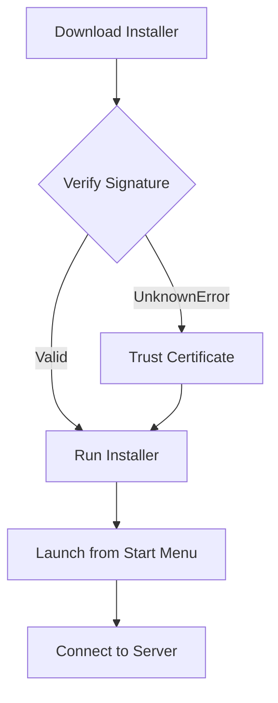
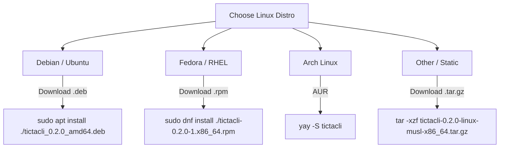

# Installation Guide

This guide explains how to install the TicTacToe Client.

## Supported Platforms

Currently, pre-built installers are available for **Windows 10 and 11**.


## Overview



## Windows 10/11 (.exe installer)

The recommended installation method for most users is the `.exe` installer (built with Inno Setup). It supports per-user and per-machine installations and creates a Start Menu shortcut.

### 1. Download
Download the latest `tictacli-X.Y.Z-setup.exe` from the GitHub Releases page.

### 2. Verify the Signature
The installer is signed using a self-signed certificate by CodeAlchemy-Labs. You can verify it hasn't been tampered with by running this in PowerShell:

```powershell
Get-AuthenticodeSignature -FilePath .\tictacli-0.2.0-setup.exe | Format-List
```

If you have trusted the certificate, you will see `Status : Valid`.
If you haven't trusted it, you will see `Status : UnknownError`. Both are acceptable. `HashMismatch` means the file is corrupt.

### 3. Trust the Certificate (Optional but Recommended)
Because the certificate is self-signed, Windows SmartScreen will warn you when running the installer. To suppress this warning, you must trust the CodeAlchemy-Labs certificate.
For instructions on how to do this, see the [Certificate Documentation](../packaging/certs/README.md).

### 4. Install
Run the installer. Follow the prompts to complete the installation. You can choose to add a Desktop shortcut during this process.

### 5. Launch
You can now launch the game by searching for "TicTacToe Client" in your Start Menu.
The application will open and present a connection screen, prompting you for a server URL and a guest name.

### 6. Uninstall
You can uninstall the client by going to Settings > Apps > Installed apps, searching for "TicTacToe Client", and clicking Uninstall.

## Windows 10/11 (.msi installer)

Enterprise users or users who prefer Windows Installer can use the `.msi` package (built with WiX Toolset).

### 1. Download and Verify
Download `tictacli-X.Y.Z.msi` and verify the signature using the same method as above.

### 2. Install
Double-click the `.msi` file to run the installer.

**Silent Installation:**
```cmd
msiexec /i tictacli-0.2.0.msi /qn
```

### 3. Uninstall
You can uninstall via Windows Settings, or silently via the command line:

```cmd
msiexec /x tictacli-0.2.0.msi /qn
```
## Linux

| Distribution | Version range | Package | Compatibility |
|---|---|---|---|
| Debian | 11+ | `.deb` | glibc 2.31+ |
| Ubuntu | 20.04+ | `.deb` | glibc 2.31+ |
| Linux Mint | 20+ | `.deb` | glibc 2.31+ |
| Fedora | 30+ | `.rpm` | glibc 2.28+ |
| RHEL / Rocky / Alma | 8+ | `.rpm` | glibc 2.28+ |
| Arch, Manjaro, EndeavourOS | rolling | `.pkg.tar.zst` | n/a (native) |
| Any Linux (fallback) | any | `.tar.gz` (musl) | static |



### Debian / Ubuntu (`.deb`)
Download the `.deb` package and install it via `apt`:
```bash
sudo apt install ./tictacli_0.2.0_amd64.deb
```
Launch the client from your application menu or by running `tictacli` in the terminal. To uninstall: `sudo apt remove tictacli`.

For the server: `sudo apt install ./tictacli-server_0.2.0_amd64.deb`
For both: `sudo apt install ./tictacli-full_0.2.0_all.deb`

### Fedora / RHEL / Rocky / Alma (`.rpm`)
Download the `.rpm` package and install it via `dnf`:
```bash
sudo dnf install ./tictacli-0.2.0-1.x86_64.rpm
```
Launch from the application menu or terminal. To uninstall: `sudo dnf remove tictacli`.

### Arch Linux (AUR)
Install the package from the Arch User Repository (AUR) using an AUR helper like `yay` or `paru`:
```bash
yay -S tictacli
```
*(Note: AUR packages will be published after Stage 7. Until then, you can run `makepkg` manually from the `packaging/linux/arch/` directory).* 

### Static musl build
For older distributions, chroot environments, or containers without glibc, a statically linked musl variant is available. Extract and run it:
```bash
tar -xzf tictacli-0.2.0-linux-musl-x86_64.tar.gz
./tictacli-0.2.0/tictacli
```

