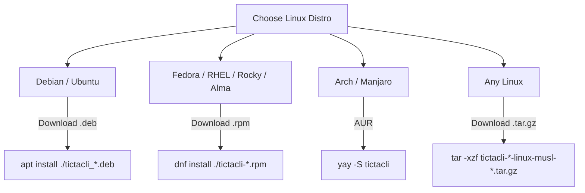
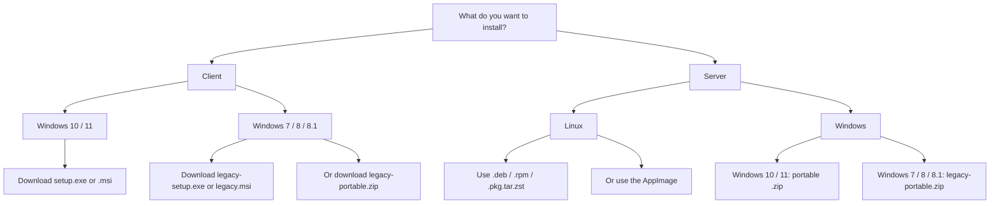
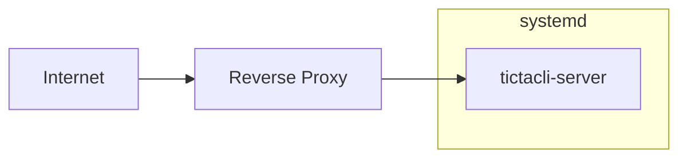

# Installation Guide

## Introduction
This guide explains how to install the TicTacToe client and server. We provide pre-built native packages for Windows 10/11 and Linux distributions, and a dedicated legacy build path for Windows 7/8/8.1 that targets Rust 1.77 and disables the Ratatui underline-color feature for compatibility with the older console stack.

## Verifying release artefacts

The release tarballs and archives are signed with the CodeAlchemy-Labs GPG signing key. The key fingerprint is published in `packaging/certs/gpg-fingerprint.txt` and is shown here for convenience:

```text
CodeAlchemy-Labs GPG signing key
=================================

Fingerprint:
  382C EF98 8949 C035 798A  8FE6 C63E A044 D207 C82C

Long key ID:
  C63EA044D207C82C

Key server:
  https://keys.openpgp.org/vks/v1/by-fingerprint/382CEF988949C035798A8FE6C63EA044D207C82C

Key type:
  RSA 4096, signing and certification primary key
  RSA 4096, encryption subkey
  Created 2026-09-22, expires 2028-09-21

Usage:
  All .deb, .rpm, .tar.gz, and .zip release artefacts are signed with this
  key. The detached signatures are published as .asc files alongside each
  artefact. A SHA256SUMS.asc file signs the aggregate checksums.

  See docs/INSTALLATION.md for verification instructions.

Import:
  gpg --keyserver keys.openpgp.org --recv-keys 382CEF988949C035798A8FE6C63EA044D207C82C
```

Import the public key:

```bash
gpg --keyserver keys.openpgp.org --recv-keys 382CEF988949C035798A8FE6C63EA044D207C82C
```

### Verifying a `.deb`

`debsig-verify` is the package-native check for Debian/Ubuntu packages. The command is:

```bash
debsig-verify tictacli_0.4.0_amd64.deb
```

This requires the Debian policy file for `debsigs` to be installed. See the Debian documentation for setup instructions: <https://wiki.debian.org/Teams/Debsig/Howto>. If you prefer a lighter verification path, check the signed aggregate checksum instead:

```bash
gpg --verify SHA256SUMS.asc SHA256SUMS
sha256sum -c SHA256SUMS
```

### Verifying an `.rpm`

```bash
rpm --import https://keys.openpgp.org/vks/v1/by-fingerprint/382CEF988949C035798A8FE6C63EA044D207C82C
rpm --checksig tictacli-0.4.0-1.x86_64.rpm
```

### Verifying a detached `.asc`

```bash
gpg --verify tictacli-0.4.0-x86_64-portable.zip.asc tictacli-0.4.0-x86_64-portable.zip
```

### Verifying the full `SHA256SUMS`

```bash
gpg --verify SHA256SUMS.asc SHA256SUMS
sha256sum -c SHA256SUMS
```

### Arch and AppImage status

The `.pkg.tar.zst` and `.AppImage` artefacts are intentionally not GPG-signed in this release. For Arch, the package integrity story is the AUR mechanism once the AUR package is published; the .pkg.tar.zst files are built from the tagged source in the release pipeline and are not signed with the maintainer key. For AppImage, users can verify the corresponding entry in `SHA256SUMS` and `SHA256SUMS.asc` as the expected integrity check.

Windows `.exe` and `.msi` binaries are signed with Authenticode, not GPG. Follow the existing [Verifying the Windows signature](#verifying-the-windows-signature) procedure for certificate trust and signature validation.

## Compatibility matrix

| Platform | Version / target | Package | Notes |
|---|---|---|---|
| Windows 10 / 11 | modern client | `.exe` / `.msi` | primary supported path |
| Windows 7 / 8 / 8.1 | legacy client | architecture-specific legacy `.zip` / `.exe` / `.msi` | EOL compatibility build |
| Windows 7 / 8 / 8.1 | legacy server | architecture-specific legacy portable `.zip` | EOL compatibility build |
| Debian | 11+ | `.deb` | glibc 2.31 |
| Ubuntu | 20.04+ | `.deb` | glibc 2.31 |
| Fedora | 30+ | `.rpm` | glibc 2.28 |
| RHEL / Rocky / Alma | 8+ | `.rpm` | glibc 2.28 |
| Arch / Manjaro | rolling | `.pkg.tar.zst` | n/a |
| Any Linux | fallback | `.tar.gz` (musl) | n/a |

## Windows 10/11 (`.exe`)

The `.exe` installer (built with Inno Setup) is the recommended method for most Windows users. It supports per-user and per-machine installations and creates a Start Menu shortcut.

### 1. Download
Download `tictacli-<version>-setup.exe` from the GitHub Releases page.

### 2. Verify Signature and Trust Certificate
Windows SmartScreen will warn you when running the installer because our certificate is self-signed. You must verify and trust the CodeAlchemy-Labs certificate. See [Verifying the Windows signature](#verifying-the-windows-signature) below, and [Certificate Documentation](../packaging/certs/README.md) to trust it.

### 3. Install
Run the installer and follow the prompts.

### 4. Launch
Launch "TicTacToe Client" from your Start Menu.

### 5. Uninstall
Uninstall by going to **Settings > Apps > Installed apps**, searching for "TicTacToe Client", and clicking **Uninstall**.

## Windows 10/11 (`.msi`)

For enterprise environments or silent deployments, use the `.msi` package (built with WiX Toolset).

### 1. Download
Download `tictacli-<version>.msi` from the GitHub Releases page.

### 2. Install
Double-click to install, or run silently:
```cmd
msiexec /i tictacli-<version>.msi /qn
```

### 3. Uninstall
Uninstall via Windows Settings, or silently:
```cmd
msiexec /x tictacli-<version>.msi /qn
```

## Windows 7 / 8 / 8.1 legacy build

The legacy build path is intended for older Windows systems that lack the modern Windows 10/11 console features used by the default client configuration. It is built with the Rust 1.77 MSRV and includes the `legacy-console` feature enabled:

```powershell
cargo +1.77.2 build --release --target x86_64-pc-windows-gnu --no-default-features --features legacy-console --bin tictacli
cargo +1.77.2 build --release --target i686-pc-windows-gnu --no-default-features --features legacy-console --bin tictacli
```

This build disables the Ratatui underline-color support, which is the compatibility toggle needed for older `cmd.exe`/legacy console behavior. The legacy path is not distributed through the modern installer flow and should be treated as a separate compatibility artefact.

### Legacy installers

For older, end-of-life Windows systems, the project releases dedicated compatibility packages:

- `tictacli-x86_64-legacy-setup.exe` and `tictacli-x86_64-legacy.msi`
- `tictacli-i686-legacy-setup.exe` and `tictacli-i686-legacy.msi`

These are for Windows 7 / 8 / 8.1 only. They are compatibility packages for a deprecated console stack and are intentionally kept separate from the modern Windows 10/11 installer flow.

### Legacy client portable archives

As an alternative to the installers, download
`tictacli-<version>-x86_64-legacy-portable.zip` or
`tictacli-<version>-i686-legacy-portable.zip`. Extract the archive and run
`tictacli.exe` from the extracted directory.

## Verifying the Windows signature

You can verify that the `.exe` or `.msi` installer hasn't been tampered with by checking its Authenticode signature in PowerShell:

```powershell
Get-AuthenticodeSignature -FilePath .\tictacli-<version>-setup.exe | Format-List
```

- If you have trusted our certificate, the status will be `Valid`.
- If you have not trusted it yet, the status will be `UnknownError`.
- If the file is corrupt or tampered with, the status will be `HashMismatch`.

## Linux



## Debian / Ubuntu (`.deb`)

Download the `.deb` package and install it via `apt`:
```bash
sudo apt install ./tictacli_<version>_amd64.deb
```
Launch the client from your application menu or by running `tictacli` in your terminal.

**Uninstalling:**
```bash
sudo apt remove tictacli
```

## Fedora / RHEL / Rocky / Alma (`.rpm`)

Download the `.rpm` package and install it via `dnf`:
```bash
sudo dnf install ./tictacli-<version>-1.x86_64.rpm
```
Launch the client from your application menu or terminal.

**Uninstalling:**
```bash
sudo dnf remove tictacli
```

## Arch Linux (AUR)

Install the package from the Arch User Repository (AUR) using a helper like `yay`:
```bash
yay -S tictacli
```
Alternatively, if you clone the repository, you can build and install it using `makepkg`:
```bash
cd packaging/linux/arch
makepkg -si
```

**Uninstalling:**
```bash
sudo pacman -R tictacli
```

## Static musl build

The musl builds are statically linked, making them completely independent of the system's glibc version. Prefer this fallback for older distributions, minimal container environments (like Alpine), or chroots where native packages are unavailable.

Extract the tarball:
```bash
tar -xzf tictacli-<version>-linux-musl-x86_64.tar.gz
```
Run the binary directly:
```bash
./tictacli-<version>/tictacli
```

## Portable distributions



### Linux AppImage (portable)

The AppImage is a single executable file containing everything needed to run the application. It requires no installation and no root access.

**Download:**
Download `tictacli-<version>-x86_64.AppImage` or `tictacli-server-<version>-x86_64.AppImage` from the GitHub Releases page.

**Run:**
Make the file executable and run it:
```bash
chmod +x tictacli-*.AppImage
./tictacli-*.AppImage
```

If FUSE is not available on your system (common in containers or minimal systems), you can extract and run it:
```bash
./tictacli-*.AppImage --appimage-extract-and-run
```

**Desktop integration:**
The AppImage does not install anything to disk. To add it to your desktop's application menu, you can manually create a `.desktop` file that points to the AppImage's location, or use an integration tool like `appimaged` to automatically discover and integrate AppImages. Removing the AppImage file is all that is needed to "uninstall" the application.

### Windows portable server

The Windows portable server is a standalone distribution of the server. It requires no installer, no external DLLs, and writes nothing to the registry.

**Download:**
Download `tictacli-server-<version>-x86_64-pc-windows-gnu.zip` from the GitHub Releases page.

**Contents:**
The `.zip` archive contains `tictacli-server.exe`, `README.txt`, `sample.env`, `LICENSE`, and `CHANGELOG.md`.

**Run:**
Extract the `.zip` archive to a folder of your choice. You can run `tictacli-server.exe` by double-clicking it, or from `cmd` / PowerShell.

**Configuration:**
The server reads environment variables for configuration.
In `cmd`:
```cmd
set TICTACTOE_ENV=production
tictacli-server.exe
```
In PowerShell:
```powershell
$env:TICTACTOE_ENV = 'production'
.\tictacli-server.exe
```

**Firewall and Signature:**
Windows Defender Firewall will prompt you on the first launch. Allow the app on private networks, but do not allow it on public networks unless necessary.
The `.exe` is signed with a self-signed certificate. You may see a Windows SmartScreen warning unless you trust the certificate as described in [Verifying the Windows signature](#verifying-the-windows-signature).

### Windows 7 / 8 / 8.1 legacy server

The legacy server is distributed as a standalone portable archive for older
Windows versions. Download
`tictacli-server-<version>-x86_64-legacy-portable.zip` or
`tictacli-server-<version>-i686-legacy-portable.zip` from the GitHub Releases
page.

Extract the archive and run `tictacli-server.exe` by double-clicking it or from
PowerShell. It binds to `0.0.0.0:8080` by default and logs
`listening on 0.0.0.0:8080` when ready. The archive includes `README.txt`,
`sample.env`, and `LICENSE`; set the documented environment variables before
launching when changing the default configuration.


## Service installation



The `.deb` and `.rpm` server packages (`tictacli-server`) include a sample systemd unit. This unit is disabled by default to ensure it does not start automatically before you configure it.

1. **Install the server package:**
   ```bash
   # Debian / Ubuntu
   sudo apt install ./tictacli-server_<version>_amd64.deb
   
   # Fedora / RHEL
   sudo dnf install ./tictacli-server-<version>-1.x86_64.rpm
   ```

2. **Create the dedicated system user:**
   The service is configured to run as `tictacli`.
   ```bash
   sudo useradd --system --no-create-home --shell /sbin/nologin tictacli
   ```

3. **Copy the systemd unit:**
   ```bash
   sudo cp /usr/share/doc/tictacli-server/systemd/tictacli-server.service /etc/systemd/system/
   ```

4. **Enable and start the service:**
   ```bash
   sudo systemctl daemon-reload
   sudo systemctl enable --now tictacli-server
   ```

5. **Check the status:**
   ```bash
   sudo systemctl status tictacli-server
   ```
