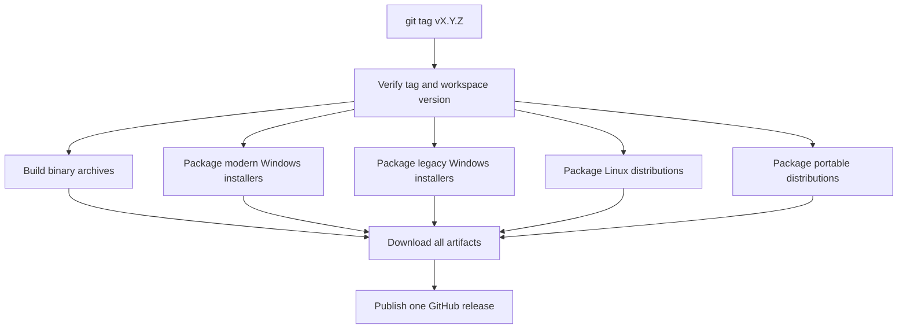

# Releasing

## Overview

Pushing a tag matching `v*.*.*` starts `.github/workflows/release.yml`. The
release workflow verifies that the tag matches the workspace version, builds
the simple Linux and Windows binary archives, and calls the four packaging
workflows: `package-windows.yml`, `package-windows-legacy.yml`,
`package-linux.yml`, and `package-portable.yml`. The publish job collects all
artifacts into one GitHub release.

## Prerequisites

- The `gh` CLI is authenticated (`gh auth status`).
- Write access to `main`.
- Permission to push tags to `origin`.
- Rust toolchains used by CI, including Rust 1.77.2 for the MSRV check.

## Cutting a release

1. Update `[workspace.package].version` in `Cargo.toml`.
2. Update `CHANGELOG.md`: move everything under `[Unreleased]` into a new
   `## [X.Y.Z] - YYYY-MM-DD` section and leave `[Unreleased]` empty.
3. Run the six workspace commands locally:

   ```sh
   cargo fmt --all -- --check
   cargo clippy --workspace --all-targets -- -D warnings
   cargo test --workspace
   cargo doc --workspace --no-deps
   cargo clippy --workspace --all-targets -- -W clippy::pedantic -W clippy::nursery
   cargo +1.77.2 build --workspace --locked
   ```

4. Commit the version and changelog changes and push to `main`.
5. Create the annotated tag: `git tag -a vX.Y.Z -m "Release vX.Y.Z"`.
6. Push the tag: `git push origin vX.Y.Z`.
7. The release workflow runs automatically. Watch it with `gh run watch`.
8. Once the release is published, verify the artifact list matches the table
   below.

## What gets published

| Artifact | Format | Target | Producing workflow job |
| --- | --- | --- | --- |
| `tictactoe-rs-X.Y.Z-x86_64-unknown-linux-gnu.tar.gz` | tar.gz | Linux x86_64 binaries | `release.yml` `binaries` |
| `tictactoe-rs-X.Y.Z-x86_64-pc-windows-msvc.zip` | zip | Windows x86_64 binaries | `release.yml` `binaries` |
| `tictacli-*-setup.exe`, `tictacli-*.msi` | signed EXE/MSI | Modern Windows 10/11 | `package-windows.yml` `build-windows-installers` |
| `tictacli-x86_64-legacy-setup.exe`, `tictacli-x86_64-legacy.msi` | signed EXE/MSI | Legacy Windows x86_64 | `package-windows-legacy.yml` `build-legacy-x86_64` |
| `tictacli-i686-legacy-setup.exe`, `tictacli-i686-legacy.msi` | signed EXE/MSI | Legacy Windows i686 | `package-windows-legacy.yml` `build-legacy-i686` |
| `tictacli-deb` packages | deb | Debian-based Linux | `package-linux.yml` `deb` |
| `tictacli-rpm` packages | rpm | RPM-based Linux | `package-linux.yml` `rpm` |
| `tictacli` Arch packages | pkg.tar.zst | Arch Linux | `package-linux.yml` `arch` |
| `tictacli` musl archives | tar.gz | Linux x86_64 musl | `package-linux.yml` `musl` |
| `tictacli` AppImages | AppImage | Linux desktop | `package-portable.yml` `appimage` |
| Windows portable server | zip | Windows x86_64 | `package-portable.yml` `windows-portable` |

## Verifying a release

Download the release assets from GitHub and inspect the Windows signatures:

```sh
gh release download vX.Y.Z --dir release-X.Y.Z
osslsigncode verify release-X.Y.Z/tictacli-*-setup.exe
osslsigncode verify release-X.Y.Z/tictacli-*.msi
```

Check a Linux package checksum after downloading it:

```sh
sha256sum release-X.Y.Z/tictacli*.deb
sha256sum release-X.Y.Z/tictacli*.rpm
```

The signature verification should report a valid signature from the expected
CodeAlchemy-Labs certificate. Record the SHA-256 values when verifying a
release for an incident or support request.

## Hotfixing a release

Only move a release tag if nobody has downloaded the release yet. Coordinate
with maintainers, then delete and recreate the tag:

```sh
git tag -d vX.Y.Z
git push origin :refs/tags/vX.Y.Z
git tag -a vX.Y.Z -m "Release vX.Y.Z"
git push origin vX.Y.Z
```

This starts a new release run from the corrected commit.

## Rolling back

Delete the GitHub release, delete the tag from the remote, and fix forward in
`main` before creating a replacement release. Do not overwrite a release that
may already have been downloaded; publish a new patch version instead.

## Release flow



Validate the diagram at https://mermaid.live before changing its syntax.
