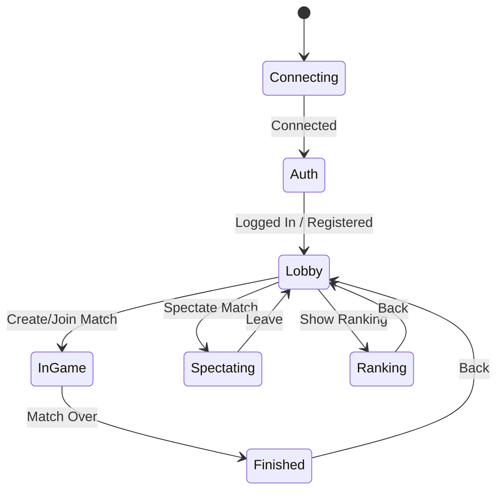
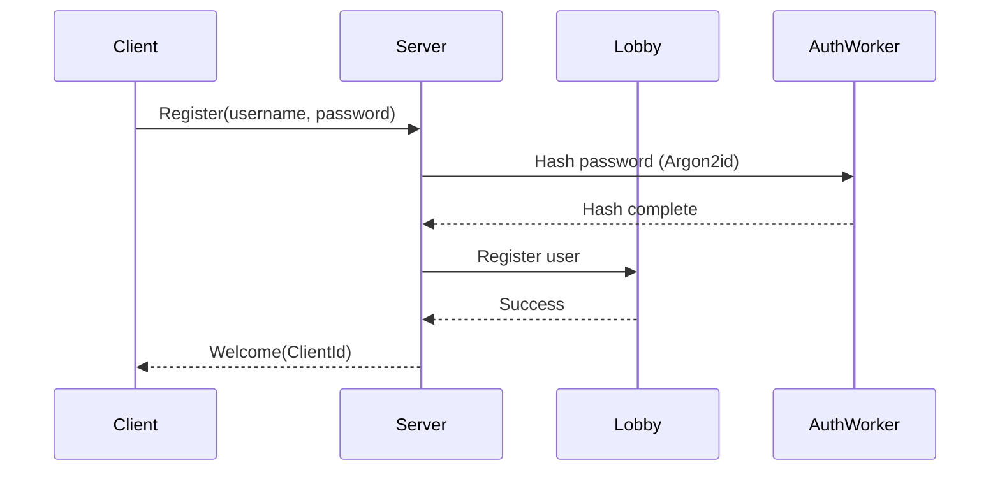
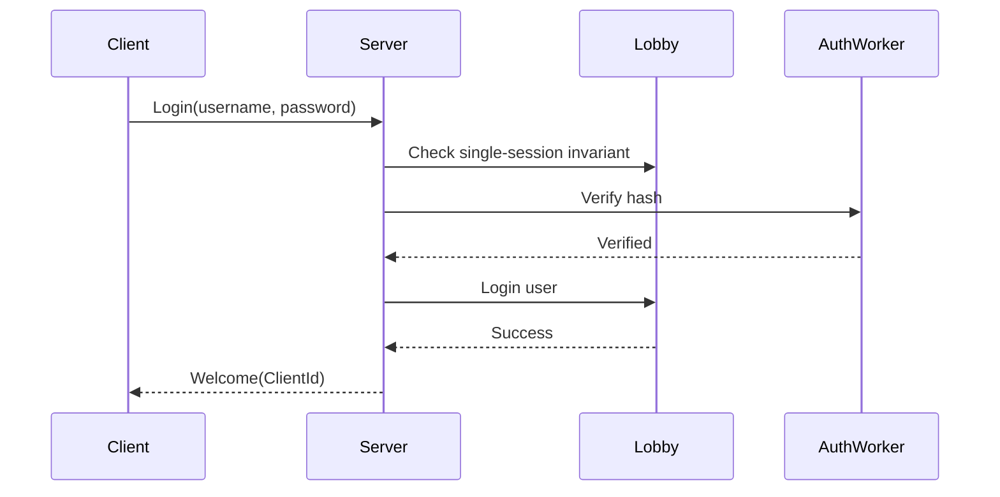
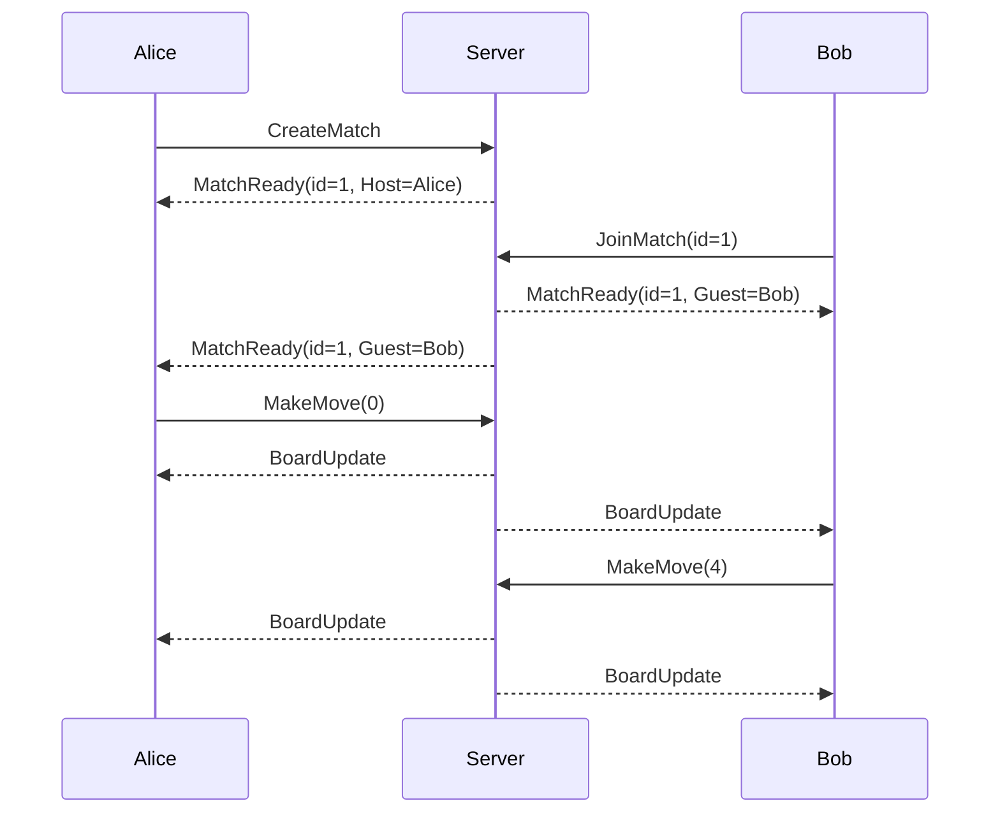
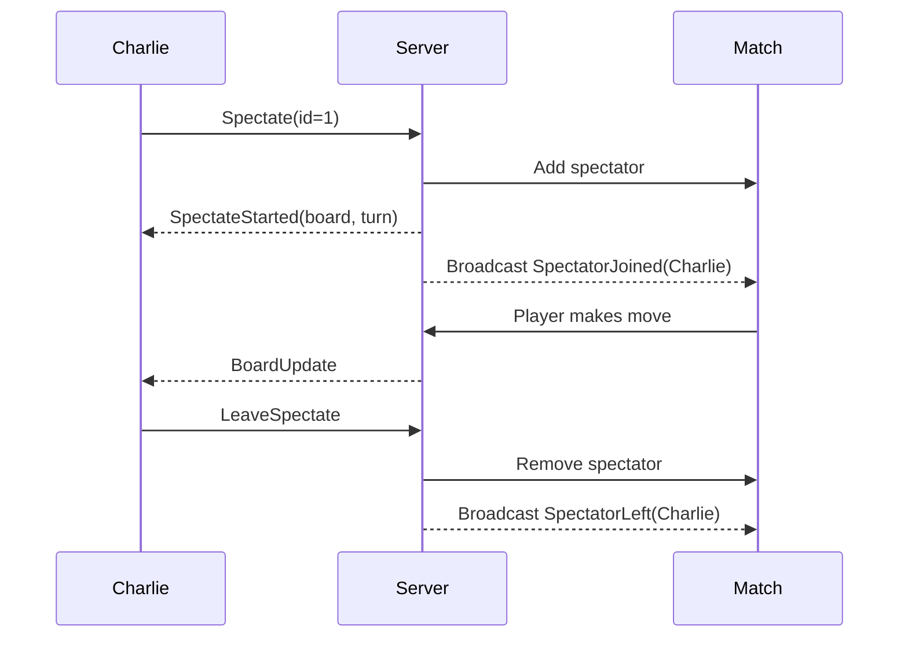
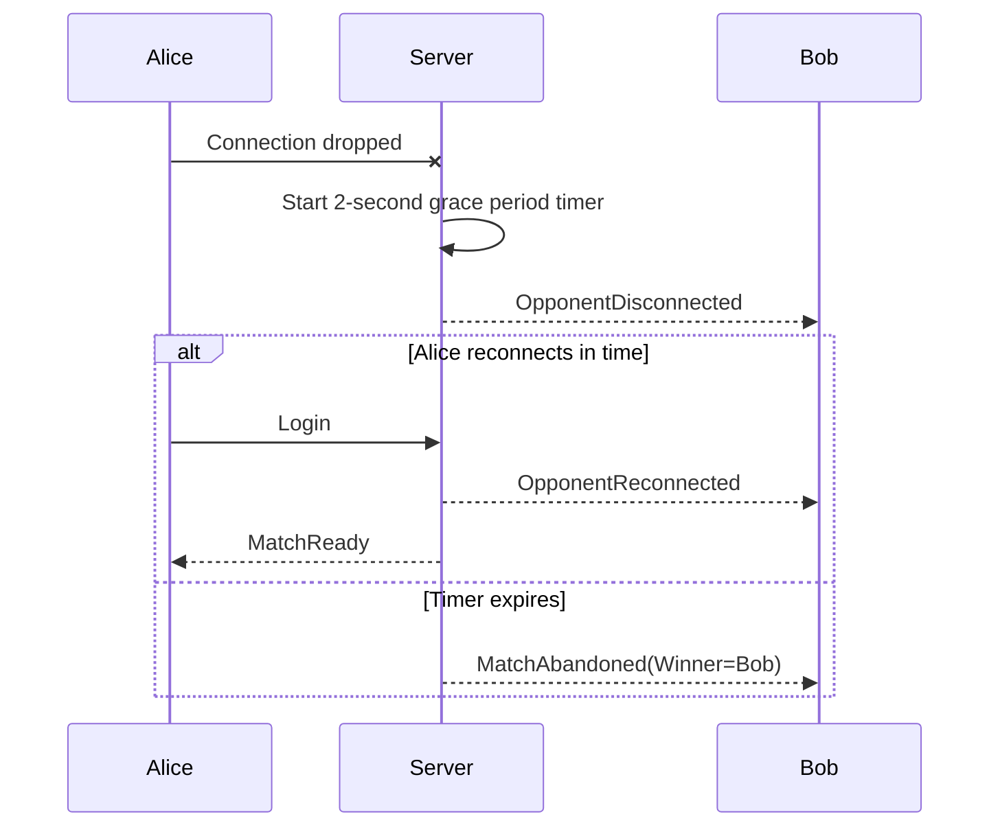
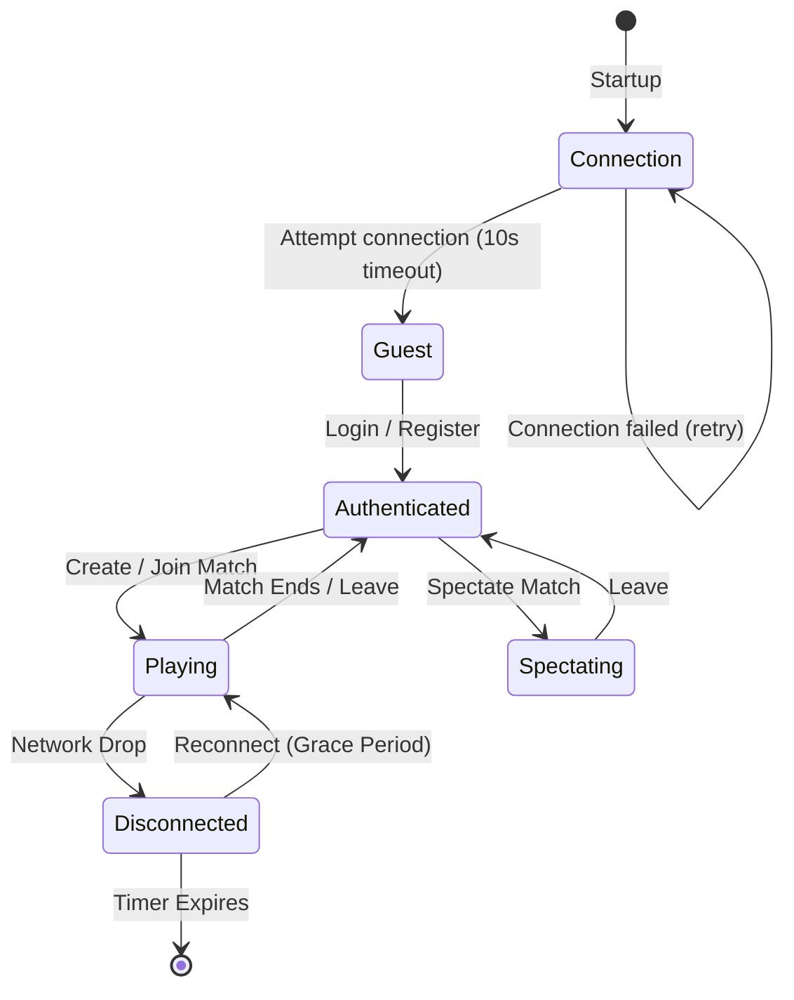
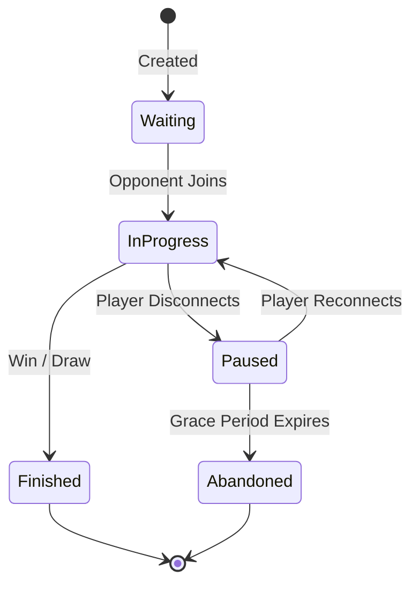

# Installing the client

For instructions on downloading and installing the TicTacToe Client on Windows 10/11, please see the [Installation Guide](INSTALLATION.md).

When you launch the client using the created Start Menu shortcut, it starts without arguments, and the connection screen will appear automatically to prompt for your server URL and guest name.

# User Guide

Welcome to the `tictactoe-rs` user guide. This document explains how to install, configure, and use the Tic-Tac-Toe client and server.

## Installing and running

The client binary is `tictacli` on every platform.


### Pre-built binaries
For a quick start, download the binaries for your platform from the [Releases](https://github.com/CodeAlchemy-Labs/tictactoe-rs/releases) page. Extract the archive and you'll have three executables: `server`, `client`, and `hacker`.

### Docker
To run the server in Docker:
```bash
make demo
```
This builds and starts the server on port 8080. You can then connect clients normally. To shut down:
```bash
make demo-down
```

### Source build
Ensure you have Rust and Cargo installed, then run:
```bash
cargo run --release --bin server
cargo run --release --bin tictacli -- --server ws://127.0.0.1:8080/ws --name alice
```

## Connecting to a server

Start the client with the required arguments:
- `--server`: The WebSocket URL of the server (e.g., `ws://127.0.0.1:8080/ws`). Can also be set via the `TICTACTOE_SERVER` environment variable.
- `--name`: Your display name. Can also be set via `TICTACTOE_NAME`.
- `--insecure`: Use this flag to disable TLS certificate verification when connecting to a development server with a self-signed certificate (e.g., `wss://...`). Never use this against production endpoints.

## Screen map

The terminal client utilizes a state machine composed of multiple screens.



### Connecting
The initial state while establishing a WebSocket connection with the server. If successful, transitions to Auth.

### Auth
The authentication screen where you can register a new account or log in to an existing one.

### Lobby
The main hub. You can view open matches, create a match, join an opponent's match, view rankings, or spectate active matches.

### InGame
The active gameplay screen where you take turns marking the Tic-Tac-Toe board.

### Spectating
A read-only view of a match currently in progress between two other players.

### Ranking
Displays the top 10 registered players ranked by total wins.

### Finished
Shows the final board state and the outcome (Win, Loss, Draw, or Match Abandoned).


## Connecting to a server

When you start `tictacli`, it attempts to connect to a server. The target server and guest name are resolved using the following priority (highest to lowest):

1. **CLI Flags**: `--server` and `--name`
2. **Environment Variables**: `TICTACTOE_SERVER` and `TICTACTOE_NAME`
3. **Saved Configuration**: Values saved from your last successful interactive connection (stored in your OS config directory).
4. **Fallback defaults**: `whoami` for the guest name, and empty for the server.

If both the server URL and guest name can be resolved from CLI flags or environment variables, the client takes the **fast-path**: it skips the UI and attempts to connect immediately.

If the information is incomplete, or sourced from the config file, the client will present the **Connection** screen, allowing you to edit the fields before pressing `Enter`. 

When connecting, the client enforces a 10-second timeout. If the server is unreachable, the client will gracefully return you to the Connection screen with an error message so you can retry.

## Keyboard reference

| Screen | Key | Action |
|---|---|---|
| **Anywhere** | `q` | Quit the application (except in Auth and Connection) |
| **Connection** | `Tab` | Next field |
| | `Shift+Tab` | Previous field |
| | `F3` | Toggle TLS (`ws://` vs `wss://`) |
| | `Enter` | Attempt connection |
| | `Esc` | Quit |
| | `Backspace` | Delete character |
| **Auth** | `Tab` | Next field |
| | `Shift+Tab` | Previous field |
| | `F2` | Toggle mode (Login / Register) |
| | `F3` | Toggle password reveal |
| | `Enter` | Submit form |
| | `Esc` | Cancel / Quit |
| | `Backspace` | Delete character |
| **Lobby** | `c` | Create a match |
| | `r` | Refresh the matches list |
| | `t` | Show ranking |
| | `s` | Toggle spectator mode |
| | `1`–`9` | Join the numbered match (or spectate if spectator mode is on) |
| | `Esc` | Exit spectator mode (if on), otherwise Quit |
| **InGame** | `1`–`9` | Play a move in the corresponding cell |
| | `l` | Leave match |
| **Spectating**| `Esc` | Leave spectate |
| **Ranking** | `Esc` | Return to Lobby |
| **Finished** | `Esc` | Return to Lobby |

## Flows

### Register a new account



### Login to an existing account



### Create and play a match



### Spectate a match



### Disconnection and grace period



### Session lifecycle



### Match lifecycle



## Error handling

If an action fails, the server responds with a typed `ErrorCode`.

| Error Code | Meaning | Action |
|---|---|---|
| `InvalidState` | The client sent a message not valid in its current state. | Client protocol bug. Restart client. |
| `MatchNotFound` | The requested match ID does not exist or has finished. | Refresh the lobby and try again. |
| `MatchFull` | You tried to join a match that already has two players. | Join a different match. |
| `IllegalMove` | You attempted to place a mark on an occupied cell. | Choose a different cell. |
| `MalformedMessage` | The server could not parse your JSON request. | Client protocol bug. Update client. |
| `NotInMatch` | You tried to make a move but are not in an active match. | Wait for the match to start. |
| `InvalidDisplayName` | Username was rejected (too short, too long, invalid characters). | Choose a valid alphanumeric username. |
| `AuthenticationRequired` | You attempted an action that requires being logged in. | Login or register first. |
| `CannotJoinOwnMatch` | You tried to join a match you created. | Wait for an opponent to join. |
| `SpectatorLimitReached` | The match already has 5 spectators. | Try spectating another match. |
| `AlreadySpectating` | You tried to spectate while already spectating. | Leave the current spectate view first. |
| `TooManySessions` | The server has hit its global or per-IP session limits. | Wait and try again later. |
| `Unknown` | An unrecognized error occurred. | Ensure your client version matches the server. |

## Environment variables

The server is configured entirely via environment variables.

| Variable | Default (Dev) | Default (Prod) | Description |
|---|---|---|---|
| `TICTACTOE_ENV` | `development` | N/A | Deployment mode. `production` enables strict limits. |
| `TICTACTOE_BIND` | `0.0.0.0:8080` | `0.0.0.0:8080` | The primary bind address. |
| `PORT` | `8080` | `8080` | Fallback port for container platforms (e.g., Render). |
| `TICTACTOE_MAX_SESSIONS` | `10000` | `10000` | Global concurrent WebSocket limit. |
| `TICTACTOE_MAX_SESSIONS_PER_IP`| `10000` | `10` | Max concurrent sessions from a single IP. |
| `TICTACTOE_AUTH_RATE_LIMIT_PER_MINUTE` | `1000` | `10` | Auth requests per minute per IP. |

## Troubleshooting

### Connection refused
**Symptom**: `Failed to connect: Connection refused (os error 111)`
**Fix**: Ensure the server is running on the specified host and port. If running locally via Docker, make sure the port `8080` is exposed.

### TUI rendering issues
**Symptom**: Artifacts on the screen or unstyled text.
**Fix**: Ensure your terminal emulator supports ANSI escape sequences and true color. Resize the terminal window to trigger a redraw.

### Server responds with `TooManySessions`
**Symptom**: Instant disconnection upon launch.
**Fix**: In production mode, the server strictly limits the number of connections per IP to 10. Close zombie clients or wait for the IP rate limit bucket to refill.

### Cannot run the hacker scenario against production
**Symptom**: `Error: Refusing to target remote host in non-local environment`
**Fix**: The hacker crate prevents accidental production DoS. You must pass `--allow-production` explicitly to target a remote server.

## FAQ

**Q: Can I spectate a match after it has started?**
A: Yes. When you select a match in spectator mode, the server sends a snapshot of the current board state and syncs you up with all subsequent moves.

**Q: What happens if my internet drops while playing?**
A: The server gives you a 2-second grace period. If you reconnect and log back in within that window, the match seamlessly resumes. Otherwise, your opponent wins by abandonment.

**Q: How is my password stored?**
A: All passwords are computationally hashed on the server using Argon2id with random salts. Raw passwords are never persisted.
